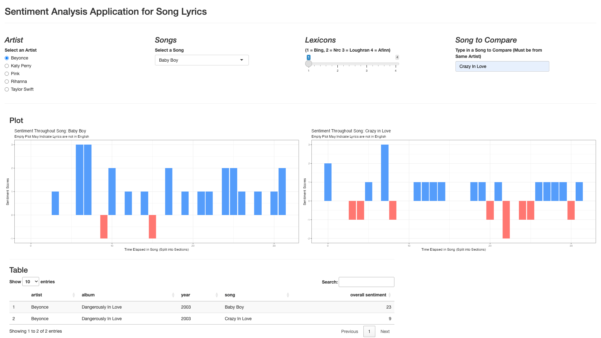

# R Shiny App for Sentiment Analysis
Sentiment Analysis App for Analyzing Song Lyrics.

## Install Dependencies
Download this repo first.

Then, install required packages:

```r
install.packages(c("shiny", "tidyverse", "tidytext", "DT", "hash", "gridExtra"))
```
**Note: Choose CRAN mirror closest to your location.**

## Running the App
You can run the app in a R terminal with:
```r
library(shiny)
runApp()
```

Or alternatively:
```r
library(shiny)
source("app.R")
shinyApp(ui = ui, server = server)
```

## About
This web app is an **interactive and reactive R Shiny application** that performs sentiment analysis on song lyrics. Users can select artists, songs, and sentiment lexicons directly in the user interface, and the app instantly updates with visualizations and statistics to explore the emotional tone of the songs.

The core components of this app include:
- **Built with R Shiny**: Provides an intuitive, interactive, and reactive user experience.

- **Sentiment Lexicons**: Analysis powered by multiple lexicon datasets:
    - bing.csv (positive/negative classification)
    - loughran.csv (multiple sentiment classifications including positive and negative)
    - afinn.csv (numeric sentiment scoring)
    - nrc.csv (eight basic emotions + positive/negative)

- Uses **tidyverse** (dplyr, ggplot2) for data manipulation and visualization.

- Uses **tidytext** to tokenize lyrics and apply sentiment dictionaries.




**App User Interface**